<p align="center">
  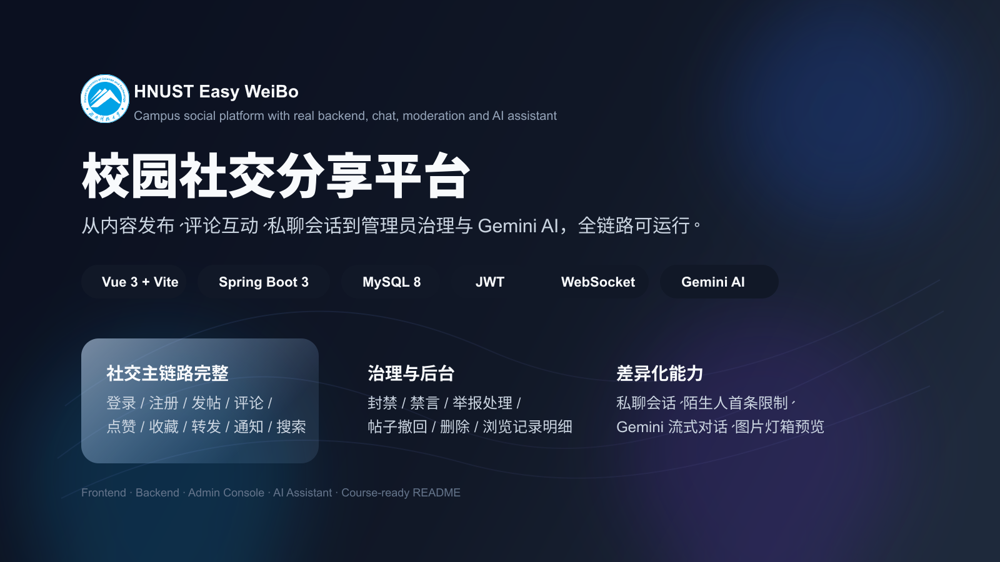
</p>

<h1 align="center">Easy-WeiBo</h1>
<p align="center">一个面向校园场景的全栈社交分享平台，覆盖内容发布、互动、私聊、后台治理与 AI 助手。</p>

<p align="center">
  
  
  
  
  
  
</p>

---

## 目录

- [项目简介](#项目简介)
- [核心亮点](#核心亮点)
- [功能演示](#功能演示)
- [技术栈](#技术栈)
- [系统架构](#系统架构)
- [功能全景](#功能全景)
- [课程要求完成情况](#课程要求完成情况)
- [快速开始](#快速开始)
- [演示账号](#演示账号)
- [接口文档](#接口文档)
- [项目结构](#项目结构)
- [项目总结](#项目总结)

---

## 项目简介

`Easy-WeiBo` 是一个围绕校园场景设计的社交分享平台课程项目，目标不是只做一个“能展示页面的前端原型”，而是完成一套真正可运行的全栈系统：

- 前端基于 `Vue 3 + Vite + TypeScript`
- 后端基于 `Spring Boot 3 + MyBatis + MySQL 8`
- 已打通用户认证、内容发布、评论互动、通知、私聊、后台治理和 AI 对话

---

## 核心亮点

### 1. 不只是“发帖 + 评论”
- 支持文字、图片内容发布
- 支持点赞、收藏、转发、评论、话题标签
- 支持浏览量统计与浏览记录明细

### 2. 有完整的社交关系链
- 关注 / 粉丝 / 互关
- 推荐关注
- 基于关系规则的一对一私聊
- 陌生人首条消息限制、拉黑、撤回、未读状态

### 3. 有完整的后台治理能力
- 管理员控制台概览
- 用户封禁 / 解封、禁言 / 解除禁言
- 举报处理、帖子撤回、帖子删除、评论删除

### 4. 有真正可用的 AI 助手
- 接入 Gemini
- 支持流式输出
- 支持历史会话与多轮对话
- 全站统一浮层调用

### 5. 前后端已经完整打通
- 不是纯 Mock 数据
- JWT 鉴权
- MySQL 持久化
- Swagger UI 在线接口文档
- WebSocket 实时同步聊天消息

---

## 功能演示

### 登录与进入系统

<p align="center">
  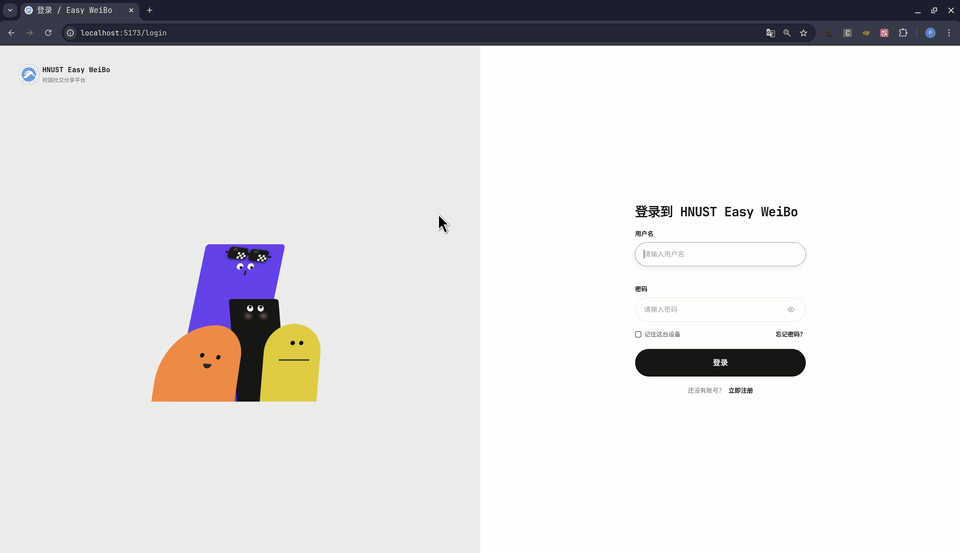
</p>

---

### 首页信息流与发帖

<p align="center">
  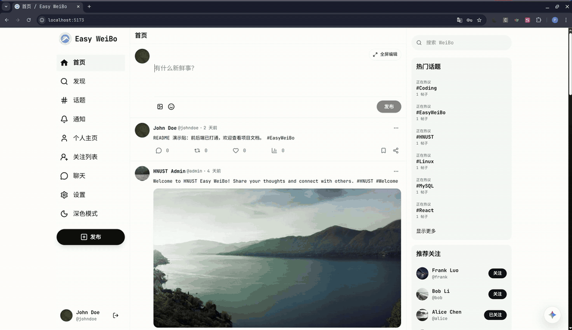
</p>

---

### 帖子详情、评论与互动

<p align="center">
  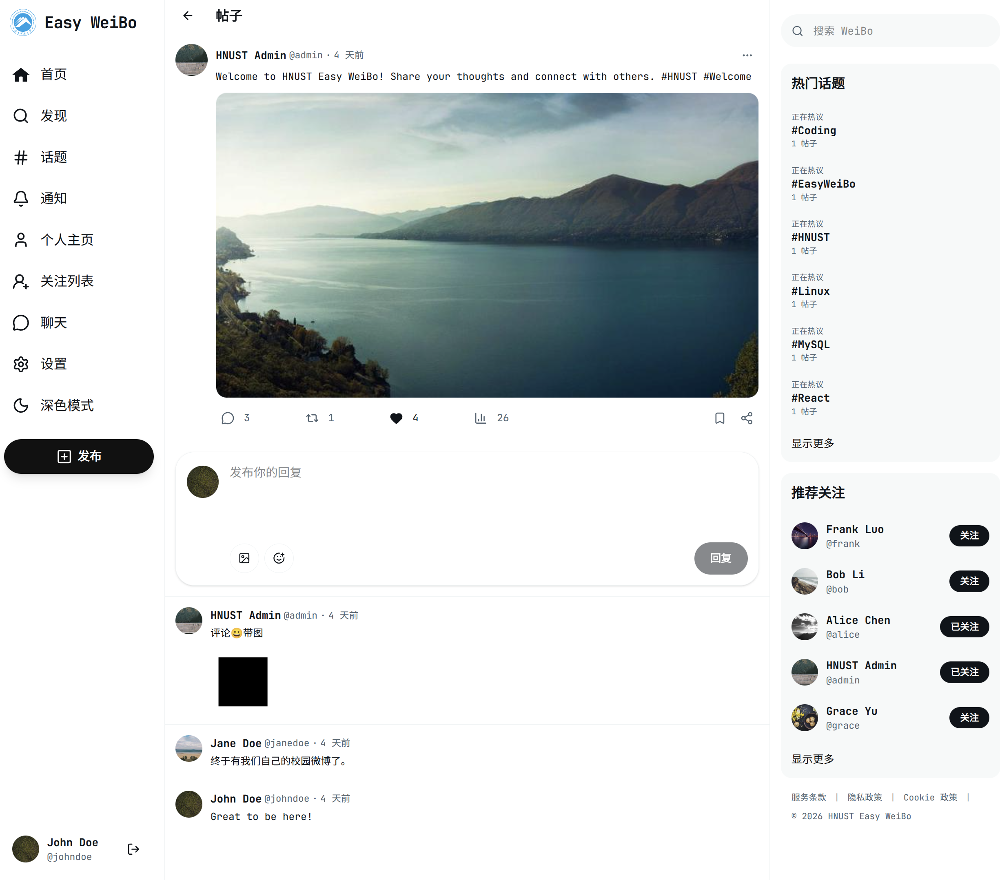
</p>

---

### 个人主页与资料页

<p align="center">
  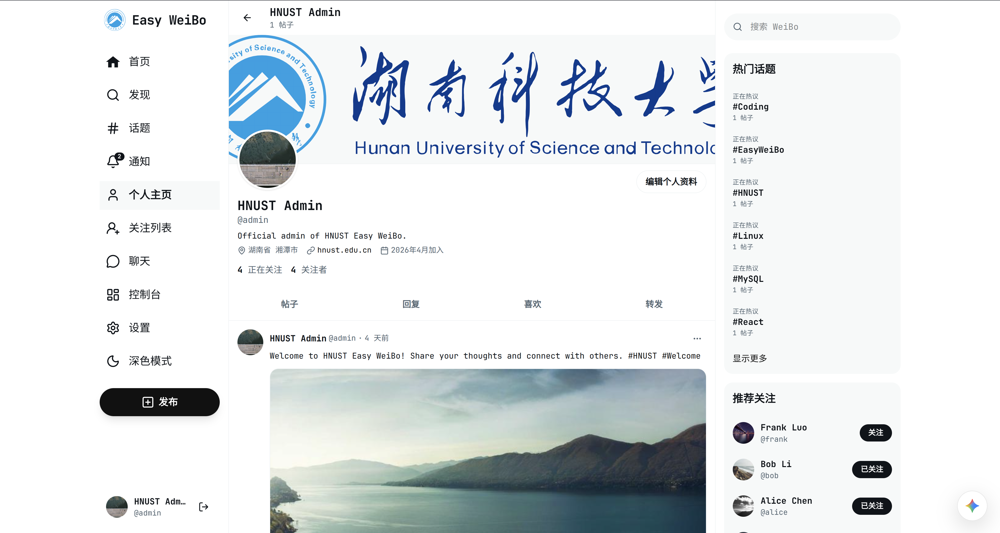
</p>

---

### 关注列表与关系管理

<p align="center">
  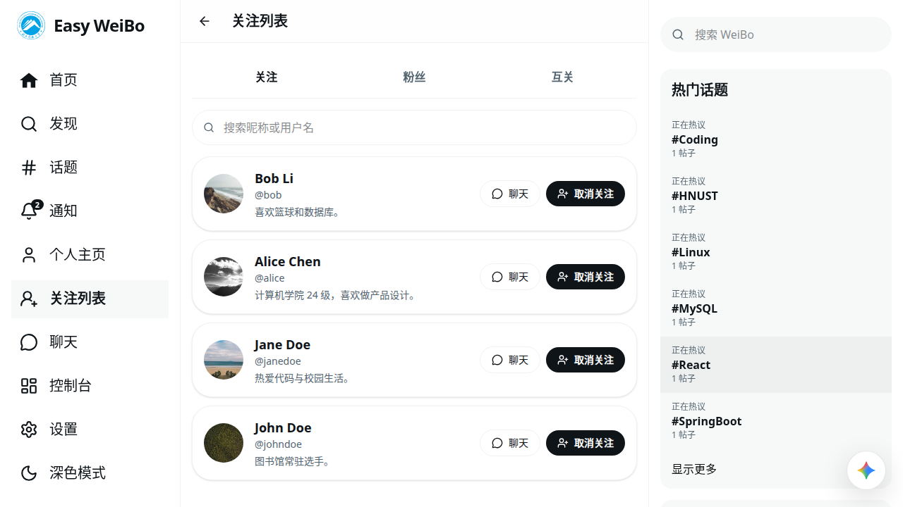
</p>

---

### 私聊与实时同步

<p align="center">
  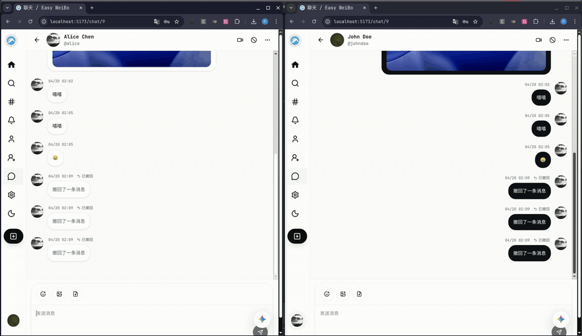
</p>

<table>
  <tr>
    <td width="50%">
      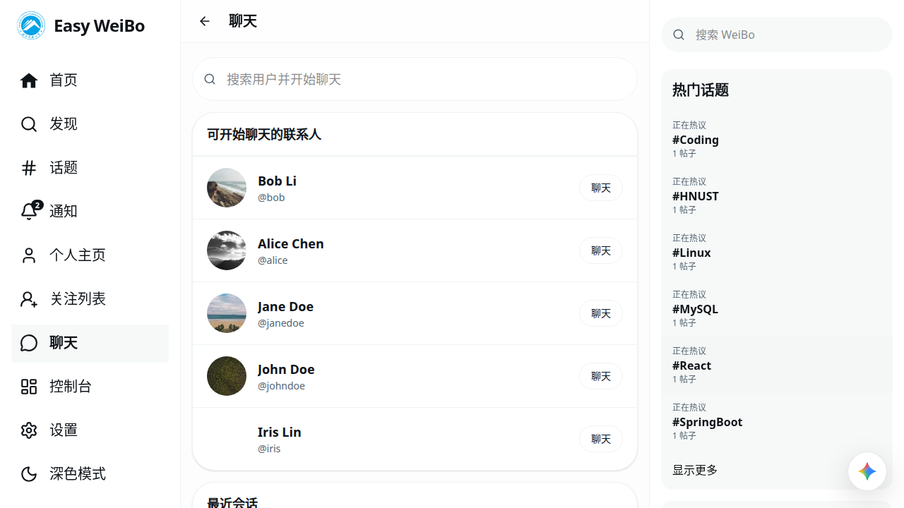
    </td>
    <td width="50%">
      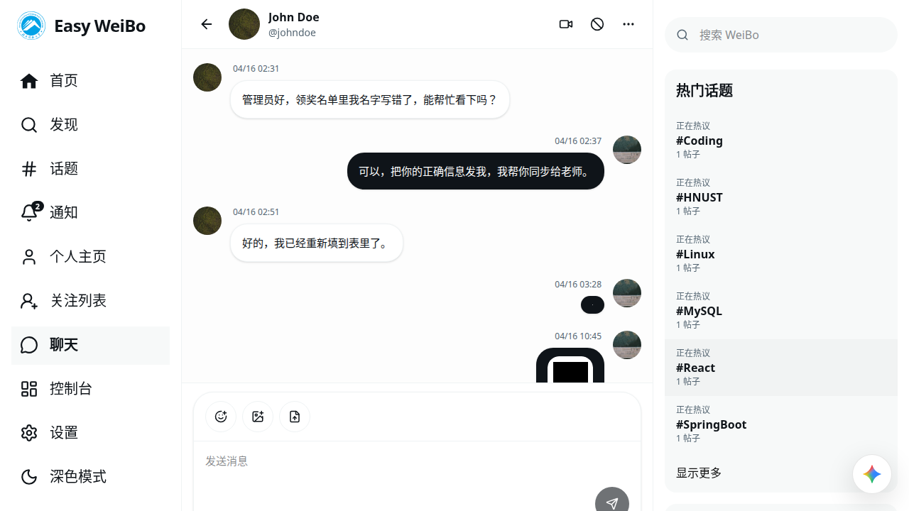
    </td>
  </tr>
</table>

---

### 热门话题与发现页

<p align="center">
  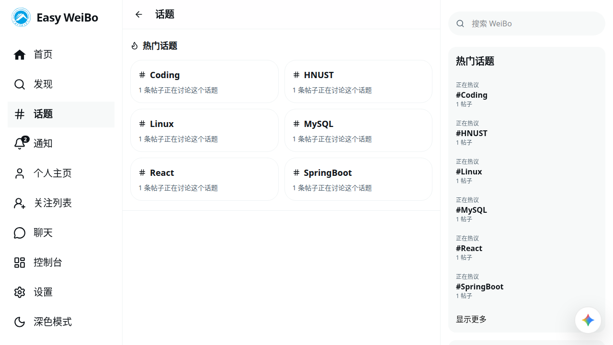
</p>

---

### Gemini AI 助手

<p align="center">
  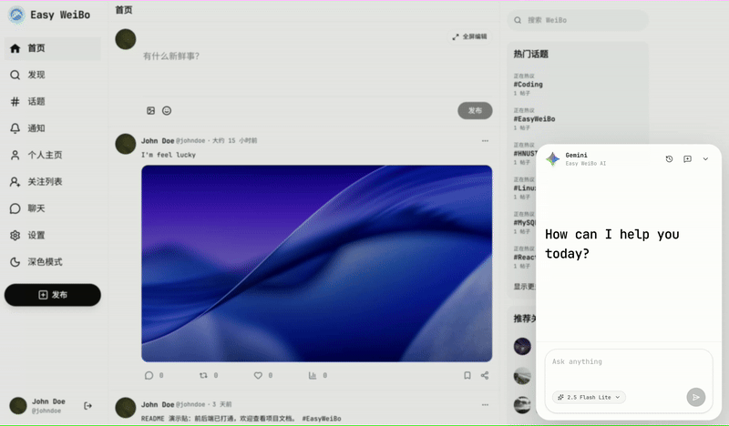
</p>

---

### 管理员控制台与举报处理

<table>
  <tr>
    <td width="50%">
      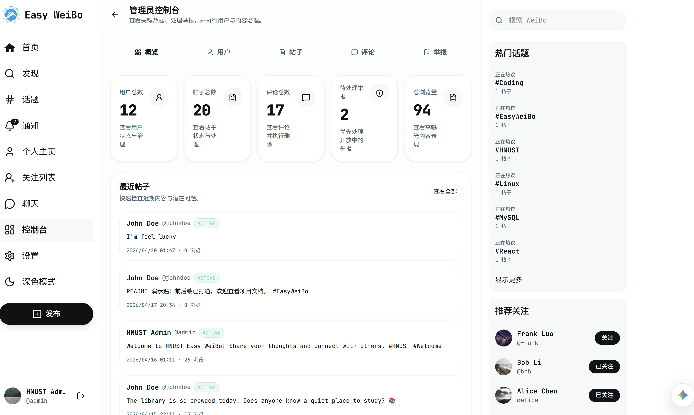
    </td>
    <td width="50%">
      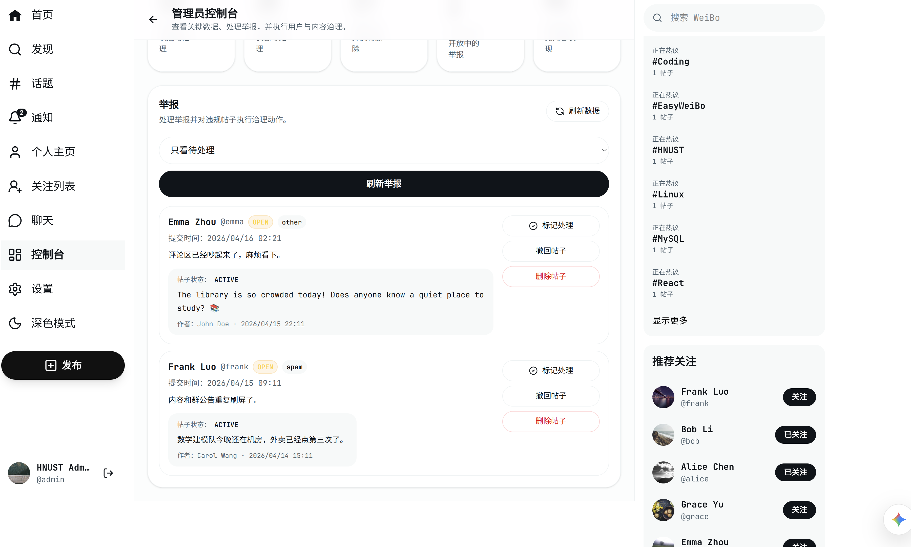
    </td>
  </tr>
</table>

---

### Swagger 在线接口文档

<p align="center">
  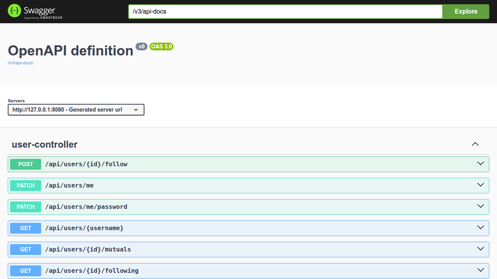
</p>

---

## 技术栈

### 前端
- `Vue 3`
- `Vite`
- `TypeScript`
- `Vue Router`
- `Lucide Icons`
- `原生 Fetch / API Service 封装`

### 后端
- `Spring Boot 3`
- `MyBatis`
- `MySQL 8`
- `JWT`
- `BCrypt`
- `WebSocket`
- `Springdoc OpenAPI / Swagger UI`

### AI 与实时能力
- `Gemini`
- `WebSocket` 用于私聊实时同步

---

## 系统架构

```{mermaid}
flowchart LR
    U[User] --> FE[Vue 3 Frontend]
    FE -->|REST API| BE[Spring Boot 3 Backend]
    FE -->|WebSocket| WS[Chat WebSocket]
    BE --> MYBATIS[MyBatis]
    MYBATIS --> DB[(MySQL 8)]
    BE --> UPLOADS[(Local Uploads)]
    BE --> GEMINI[Gemini API]
    BE --> SWAGGER[Swagger UI / OpenAPI]
```

### 数据流说明
- 前端负责界面渲染、路由、状态恢复、交互和媒体预览
- 后端负责业务规则、鉴权、数据库持久化、文件上传与治理逻辑
- MySQL 存储用户、帖子、评论、关系、通知、举报、聊天消息等核心数据
- 图片和文件保存在本地 `uploads/`，数据库只保存 URL
- 聊天实时更新通过 WebSocket 完成
- AI 对话通过后端代理调用 Gemini

---

## 功能全景

### 账号与资料
- 登录、注册、找回密码、修改密码
- JWT 鉴权
- BCrypt 密码哈希
- 个人资料编辑
- 头像与封面图上传

### 内容与互动
- 发帖、编辑、删除
- 图片上传
- 帖子详情页
- 评论、点赞、收藏、转发
- 浏览量统计与浏览记录

### 搜索与话题
- 搜索帖子
- 搜索用户
- 标签检索
- 默认热门话题页

### 社交关系
- 关注 / 取消关注
- 关注列表、粉丝列表、互关列表
- 推荐关注

### 私聊
- 一对一会话
- 最近消息预览
- 未读状态
- 撤回
- 拉黑 / 解除拉黑
- 陌生人单条开场限制
- 图片与文件消息

### 通知
- 点赞通知
- 评论通知
- 关注通知
- 提及通知
- 系统通知
- 全部已读

### 管理员控制台
- 概览统计
- 用户治理
- 帖子治理
- 评论治理
- 举报处理

### AI 助手
- Gemini 对话
- 流式输出
- 会话历史
- 页面浮层调用

---

## 快速开始

### 1. 克隆项目

```bash
git clone <your-repo-url>
cd easy-weibo
```

### 2. 启动前端

```bash
npm install
npm run dev
```

前端默认地址：

```text
http://localhost:5173
```

### 3. 启动后端

```bash
cd backend
./mvnw spring-boot:run
```

后端默认地址：

```text
http://localhost:8080
```

### 4. 数据库准备

本项目后端使用 `MySQL 8`。  
需要提前创建数据库和用户，例如：

```sql
CREATE DATABASE easyweibo CHARACTER SET utf8mb4 COLLATE utf8mb4_unicode_ci;
CREATE USER 'easyweibo'@'localhost' IDENTIFIED BY '123456';
GRANT ALL PRIVILEGES ON easyweibo.* TO 'easyweibo'@'localhost';
FLUSH PRIVILEGES;
```

### 5. Gemini 配置

若要启用 AI 对话，需要在启动后端前配置环境变量：

```bash
export GEMINI_API_KEY=your_key_here
```

如果未配置，系统仍可正常运行，只是 AI 面板会提示未配置。

---

## 演示账号

| 角色 | 用户名 | 密码 |
| --- | --- | --- |
| 管理员 | `admin` | `password123` |
| 普通用户 | `johndoe` | `password123` |
| 普通用户 | `janedoe` | `password123` |

---

## 接口文档

### 在线文档
- Swagger UI: [http://localhost:8080/swagger-ui/index.html](http://localhost:8080/swagger-ui/index.html)
- OpenAPI JSON: [http://localhost:8080/v3/api-docs](http://localhost:8080/v3/api-docs)

### 仓库内文档
- 后端接口文档：[backend/API.md](./backend/API.md)
- 后端能力总结：[backend/SUMMARY.md](./backend/SUMMARY.md)

---

## 项目结构

```text
.
├── src/                    # Vue 前端源码
│   ├── api/                # 前端接口封装
│   ├── components/         # 通用组件
│   ├── composables/        # 组合式逻辑
│   ├── pages/              # 页面
│   └── router/             # 路由配置
├── backend/                # Spring Boot 后端
│   ├── src/main/java/      # 后端业务代码
│   ├── src/main/resources/ # 配置、SQL、Mapper XML
│   ├── API.md              # 后端接口文档
│   └── SUMMARY.md          # 后端实现总结
├── public/                 # 静态资源
├── assets/readme/          # README 用截图、GIF、封面图
└── README.md
```

---

## 项目总结

`Easy-WeiBo` 的最终形态不是“只有前端页面的社交原型”，而是一套已经完成主要业务闭环的课程级全栈系统：

- 有真实数据库和后端接口
- 有完整的用户链路和内容链路
- 有治理能力和管理员控制台
- 有实时聊天和 AI 助手
- 有统一接口文档和较清晰的工程结构
